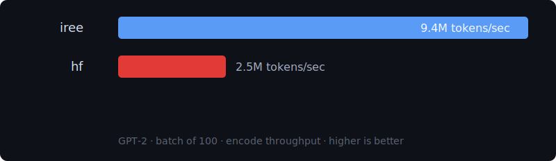
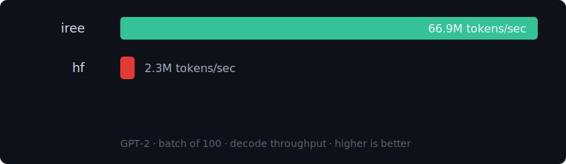

# IREE.Tokenizers

Fast Hugging Face `tokenizer.json` bindings for Elixir backed by the IREE tokenizer runtime.

## Features

- Load tokenizer definitions from a local `tokenizer.json` buffer or file
- Download and cache `tokenizer.json` files from the Hugging Face Hub
- One-shot encode/decode and batched encode/decode
- Token offsets and type IDs
- Vocab lookup helpers
- Streaming encode/decode

## Scope

V1 is intentionally inference-only.

- Supported:
  - Hugging Face `tokenizer.json`
  - BPE
  - WordPiece
  - Unigram
- Deferred:
  - `.tiktoken`
  - SentencePiece `.model`
  - pair-sequence encode input
  - training and tokenizer mutation APIs

## Repository Usage

Install dependencies and run the full local validation flow from the repo root:

```bash
mix deps.get
mix test
cargo test --manifest-path native/iree_tokenizers_native/Cargo.toml
```

In `:dev` and `:test`, the project forces a local source build of the Rust NIF,
so you do not need precompiled release assets for normal development.

## Example

```elixir
{:ok, tokenizer} = IREE.Tokenizers.Tokenizer.from_file("tokenizer.json")

{:ok, encoding} =
  IREE.Tokenizers.Tokenizer.encode(tokenizer, "Hello world", add_special_tokens: false)

encoding.ids

{:ok, text} =
  IREE.Tokenizers.Tokenizer.decode(tokenizer, encoding.ids, skip_special_tokens: false)
```

You can also load directly from the Hugging Face Hub:

```elixir
{:ok, tokenizer} = IREE.Tokenizers.Tokenizer.from_pretrained("gpt2")
```

If you need authentication for gated/private repos:

```elixir
{:ok, tokenizer} =
  IREE.Tokenizers.Tokenizer.from_pretrained("some/private-model",
    token: System.fetch_env!("HF_TOKEN")
  )
```

## Benchmarks

### Current Local Results

The current benchmark harness compares this package against the published
[`tokenizers`](https://hex.pm/packages/tokenizers) package.

#### GPT-2 batch-of-100 throughput

Current local run from [`bench/results/summary.md`](bench/results/summary.md):

- Encode:
  `iree` `9.4M tokens/sec`
  `tokenizers` `2.5M tokens/sec`
- Decode:
  `iree` `66.9M tokens/sec`
  `tokenizers` `2.3M tokens/sec`

Encode chart:



Decode chart:



#### Model latency comparison

The current checked-in local snapshot from
[`bench/results/model_matrix.md`](bench/results/model_matrix.md) contains:

| Model | Repo used | Tokenizers package (ms) | IREE oneshot / stream (ms) | Speedup |
| --- | --- | ---: | ---: | --- |
| `LiquidAI/LFM2.5-1.2B-Instruct` | `LiquidAI/LFM2.5-1.2B-Instruct` | `60.7 ms` | `4.56 ms / 4.62 ms` | `13.3x / 13.2x` |
| `Qwen/Qwen3.5-9B` | `Qwen/Qwen3.5-9B` | `70.6 ms` | `5.29 ms / 11.0 ms` | `13.4x / 6.4x` |
| `zai-org/GLM-5.1` | `zai-org/GLM-5.1` | `63.5 ms` | `5.05 ms / 5.83 ms` | `12.6x / 10.9x` |
| `mistralai/Ministral-3-3B-Reasoning-2512` | `mistralai/Ministral-3-3B-Reasoning-2512` | `63.8 ms` | `4.53 ms / 5.64 ms` | `14.1x / 11.3x` |
| `google/gemma-4-31B-it` | `google/gemma-4-31B-it` | `19.4 ms` | `3.27 ms / 3.63 ms` | `5.9x / 5.3x` |
| `google/gemma-4-31B` | `google/gemma-4-31B` | `20.6 ms` | `3.35 ms / 3.61 ms` | `6.2x / 5.7x` |
| `google/gemma-4-26B-A4B-it` | `google/gemma-4-26B-A4B-it` | `18.1 ms` | `3.3 ms / 3.61 ms` | `5.5x / 5.0x` |
| `google/gemma-4-26B-A4B` | `google/gemma-4-26B-A4B` | `21.2 ms` | `3.6 ms / 3.51 ms` | `5.9x / 6.0x` |
| `google/gemma-4-E4B-it` | `google/gemma-4-E4B-it` | `16.8 ms` | `3.53 ms / 3.55 ms` | `4.7x / 4.7x` |
| `google/gemma-4-E4B` | `google/gemma-4-E4B` | `19.7 ms` | `3.56 ms / 3.78 ms` | `5.5x / 5.2x` |
| `google/gemma-4-E2B-it` | `google/gemma-4-E2B-it` | `19.9 ms` | `3.61 ms / 3.56 ms` | `5.5x / 5.6x` |
| `google/gemma-4-E2B` | `google/gemma-4-E2B` | `20.1 ms` | `3.41 ms / 3.59 ms` | `5.9x / 5.6x` |

Current skipped target:

- `bartowski/arcee-ai_Trinity-Large-Thinking-GGUF` — no usable `tokenizer.json` exposed from the benchmarked repo/fallbacks at the time of the run

The benchmark harness itself is configured to target a broader live Hugging
Face matrix including:

- `LiquidAI/LFM2.5-1.2B-Instruct`
- `Qwen/Qwen3.5-9B`
- `zai-org/GLM-5.1` with fallback to `zai-org/GLM-5`
- `mistralai/Ministral-3-3B-Reasoning-2512`
- `bartowski/arcee-ai_Trinity-Large-Thinking-GGUF` with fallback to a non-GGUF Trinity repo when needed
- Gemma 4 variants under `google/`:
  - `gemma-4-31B-it`
  - `gemma-4-31B`
  - `gemma-4-26B-A4B-it`
  - `gemma-4-26B-A4B`
  - `gemma-4-E4B-it`
  - `gemma-4-E4B`
  - `gemma-4-E2B-it`
  - `gemma-4-E2B`

Latency chart:


Speedup chart:


### Benchmark Harness

The benchmark harness lives under [`bench/`](bench/README.md).

Set it up once:

```bash
cd bench
mix deps.get
```

Run the generic encode/decode comparison:

```bash
mix run compare.exs
```

Generate the GPT-2 batch-of-100 graphs:

```bash
mix run gpt2_graphs.exs
```

Generate the multi-model latency/speedup graphs:

```bash
mix run model_matrix_graphs.exs
```

Limit the multi-model run to a single model while iterating:

```bash
MODEL_FILTER="Qwen/Qwen3.5-9B" mix run model_matrix_graphs.exs
```

You can also target the latest GLM run specifically:

```bash
MODEL_FILTER="zai-org/GLM-5.1" mix run model_matrix_graphs.exs
```

All benchmark outputs are written to [`bench/results/`](bench/results/).

If any benchmark target requires authentication, set `HF_TOKEN` before running
the script:

```bash
HF_TOKEN=... mix run model_matrix_graphs.exs
```

## Vendored IREE Bundle

The native crate builds against a curated vendored source bundle under
`native/iree_tokenizers_native/vendor/iree_tokenizer_src`.

The vendored bundle is pinned to the IREE commit recorded in
[`native/iree_tokenizers_native/vendor/IREE_COMMIT`](native/iree_tokenizers_native/vendor/IREE_COMMIT).

To refresh that bundle from the pinned upstream IREE checkout:

```bash
scripts/update_iree_bundle.sh /path/to/iree
```
