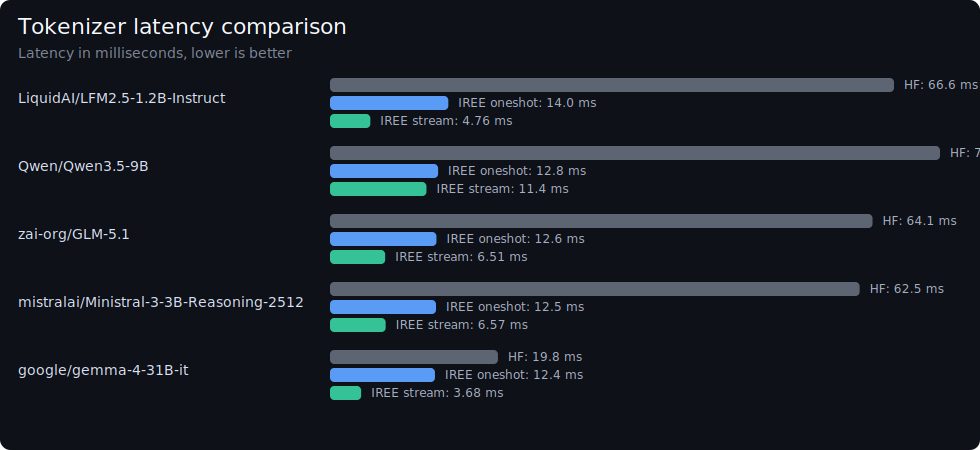
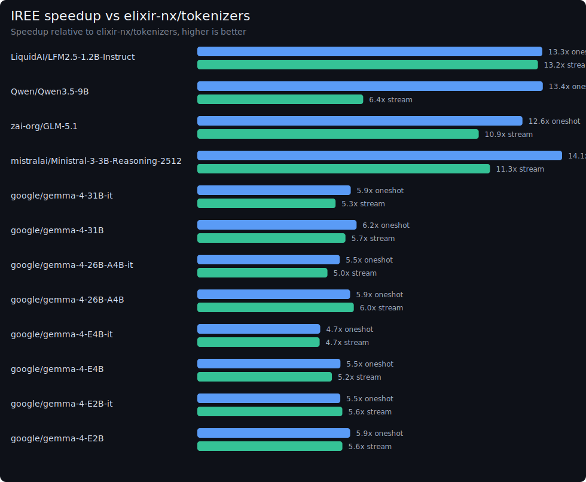

# IREE.Tokenizers

Fast Hugging Face `tokenizer.json` bindings for Elixir backed by the IREE tokenizer runtime.

## Features

- Load tokenizer definitions from a local `tokenizer.json` buffer or file
- Download and cache `tokenizer.json` files from the Hugging Face Hub
- One-shot encode/decode and batched encode/decode
- Token offsets and type IDs
- Vocab lookup helpers
- Streaming encode/decode

## Scope

V1 is intentionally inference-only.

- Supported:
  - Hugging Face `tokenizer.json`
  - BPE
  - WordPiece
  - Unigram
- Deferred:
  - `.tiktoken`
  - SentencePiece `.model`
  - pair-sequence encode input
  - training and tokenizer mutation APIs

## Repository Usage

Install dependencies and run the full local validation flow from the repo root:

```bash
mix deps.get
mix test
cargo test --manifest-path native/iree_tokenizers_native/Cargo.toml
```

In `:dev` and `:test`, the project forces a local source build of the Rust NIF,
so you do not need precompiled release assets for normal development.

## Example

```elixir
{:ok, tokenizer} = IREE.Tokenizers.Tokenizer.from_file("tokenizer.json")

{:ok, encoding} =
  IREE.Tokenizers.Tokenizer.encode(tokenizer, "Hello world", add_special_tokens: false)

encoding.ids

{:ok, text} =
  IREE.Tokenizers.Tokenizer.decode(tokenizer, encoding.ids, skip_special_tokens: false)
```

You can also load directly from the Hugging Face Hub:

```elixir
{:ok, tokenizer} = IREE.Tokenizers.Tokenizer.from_pretrained("gpt2")
```

If you need authentication for gated/private repos:

```elixir
{:ok, tokenizer} =
  IREE.Tokenizers.Tokenizer.from_pretrained("some/private-model",
    token: System.fetch_env!("HF_TOKEN")
  )
```

## Benchmarks

### Current Local Results

The benchmark harness compares this package against the published
[`tokenizers`](https://hex.pm/packages/tokenizers) package.

On a recent local GPT-2 batch-of-100 encode run, this package measured
`9.4M tokens/sec`. The IREE tokenizer author reports `10.1M tokens/sec` in the
upstream post. That difference is small enough to be unsurprising and does not
indicate a correctness problem by itself:

- the local harness measures through Elixir/NIF integration rather than a pure
  native benchmark
- the host machine, toolchain, OTP version, and scheduler behavior differ
- the comparison target in this repo is `elixir-nx/tokenizers`, not the exact
  native setup used in the upstream post

The important result is that the implementation remains in the same performance
class and preserves the expected large speedup over the Elixir `tokenizers`
package.

#### Model latency comparison

The current checked-in local snapshot from
[`bench/results/model_matrix.md`](bench/results/model_matrix.md) contains:

| Model | Repo used | Tokenizers package (ms) | IREE oneshot / stream (ms) | Speedup |
| --- | --- | ---: | ---: | --- |
| `LiquidAI/LFM2.5-1.2B-Instruct` | `LiquidAI/LFM2.5-1.2B-Instruct` | `64.0 ms` | `4.68 ms / 4.77 ms` | `13.7x / 13.4x` |
| `Qwen/Qwen3.5-9B` | `Qwen/Qwen3.5-9B` | `70.2 ms` | `4.93 ms / 11.3 ms` | `14.2x / 6.2x` |
| `zai-org/GLM-5.1` | `zai-org/GLM-5.1` | `63.1 ms` | `4.74 ms / 5.59 ms` | `13.3x / 11.3x` |
| `mistralai/Ministral-3-3B-Reasoning-2512` | `mistralai/Ministral-3-3B-Reasoning-2512` | `63.0 ms` | `4.69 ms / 5.66 ms` | `13.4x / 11.1x` |
| `google/gemma-4-31B-it` | `google/gemma-4-31B-it` | `20.1 ms` | `3.39 ms / 3.81 ms` | `5.9x / 5.3x` |

Current skipped target:

- `arcee-ai/Trinity-Large-Preview` — no usable `tokenizer.json` exposed at the time of the run

The benchmark harness intentionally keeps only one representative repo per
tokenizer family when multiple model variants share the same tokenizer. The
current family-level matrix targets:

- `LiquidAI/LFM2.5-1.2B-Instruct`
- `Qwen/Qwen3.5-9B`
- `zai-org/GLM-5.1` with fallback to `zai-org/GLM-5`
- `mistralai/Ministral-3-3B-Reasoning-2512`
- `arcee-ai/Trinity-Large-Preview`
- `google/gemma-4-31B-it`

Latency chart:



Speedup chart:



### Benchmark Harness

The benchmark harness lives under [`bench/`](bench/README.md).

Set it up once:

```bash
cd bench
mix deps.get
```

Run the generic encode/decode comparison:

```bash
mix run compare.exs
```

Generate the multi-model latency/speedup graphs:

```bash
mix run model_matrix_graphs.exs
```

Limit the multi-model run to a single model while iterating:

```bash
MODEL_FILTER="Qwen/Qwen3.5-9B" mix run model_matrix_graphs.exs
```

You can also target the latest GLM run specifically:

```bash
MODEL_FILTER="zai-org/GLM-5.1" mix run model_matrix_graphs.exs
```

All benchmark outputs are written to [`bench/results/`](bench/results/).

If any benchmark target requires authentication, set `HF_TOKEN` before running
the script:

```bash
HF_TOKEN=... mix run model_matrix_graphs.exs
```

## Vendored IREE Bundle

The native crate builds against a curated vendored source bundle under
`native/iree_tokenizers_native/vendor/iree_tokenizer_src`.

The vendored bundle is pinned to the IREE commit recorded in
[`native/iree_tokenizers_native/vendor/IREE_COMMIT`](native/iree_tokenizers_native/vendor/IREE_COMMIT).

To refresh that bundle from the pinned upstream IREE checkout:

```bash
scripts/update_iree_bundle.sh /path/to/iree
```
